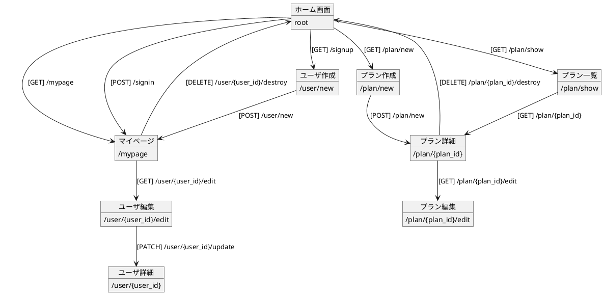

# plapoの画面遷移図

###### last-modified 👉 2018/2/3

```plantuml

@startuml

object ホーム画面 {
    root
}

object マイページ {
    /mypage
}

object ユーザ作成 {
    /user/new
}

object ユーザ詳細 {
    /user/{user_id}
}

object ユーザ編集 {
    /user/{user_id}/edit
}

object プラン一覧 {
    /plan/show
}

object プラン作成 {
    /plan/new
}

object プラン詳細 {
    /plan/{plan_id}
}

object プラン編集 {
    /plan/{plan_id}/edit
}

ホーム画面 --> マイページ : [GET] /mypage
ホーム画面 --> マイページ : [POST] /signin
ホーム画面 --> ユーザ作成 : [GET] /signup
ユーザ作成 --> マイページ : [POST] /user/new
マイページ --> ホーム画面 : [DELETE] /user/{user_id}/destroy
マイページ --> ユーザ編集 : [GET] /user/{user_id}/edit
ユーザ編集 --> ユーザ詳細 : [PATCH] /user/{user_id}/update

ホーム画面 --> プラン一覧 : [GET] /plan/show
ホーム画面 --> プラン作成 : [GET] /plan/new
プラン作成 --> プラン詳細 : [POST] /plan/new
プラン一覧 --> プラン詳細 : [GET] /plan/{plan_id}
プラン詳細 --> プラン編集 : [GET] /plan/{plan_id}/edit
プラン詳細 --> ホーム画面 : [DELETE] /plan/{plan_id}/destroy

@enduml

```